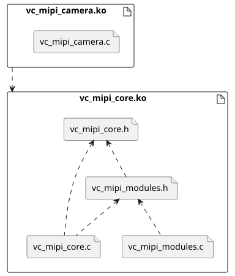

# Vision Components MIPI CSI-2 driver CORE

## Branches 

**Note:** The master branch contains the core driver code. Platform-specific implementations are maintained in separate branches (NXP, Nvidia, Raspberrypi Pi) and are not merged into master.

The `vc_mipi_camera` implementation depends on the target platform and building tool:
- **Debian package** for standard Linux distributions
- **Linux4Tegra (L4T)** for NVIDIA Jetson platforms
- **Yocto** for embedded Linux builds

* Supported [VC MIPI Camera Modules](https://www.vision-components.com/fileadmin/external/documentation/hardware/VC_MIPI_Camera_Module/index.html)n Components MIPI CSI-2 driver CORE

## Version 0.1.0 ([History](VERSION.md))

* Supported [VC MIPI Camera Modules](https://www.vision-components.com/fileadmin/external/documentation/hardware/VC_MIPI_Camera_Module/index.html) 
  * IMX178, IMX183, IMX226
  * IMX250, IMX252, IMX264, IMX265, IMX273, IMX392
  * IMX290, IMX327, IMX462
  * IMX296, IMX297
  * IMX335
  * IMX412
  * IMX415
  * IMX565, IMX566, IMX567, IMX568
  * IMX900
  * IMX585
  * OV7251, OV9281

## Deployment

